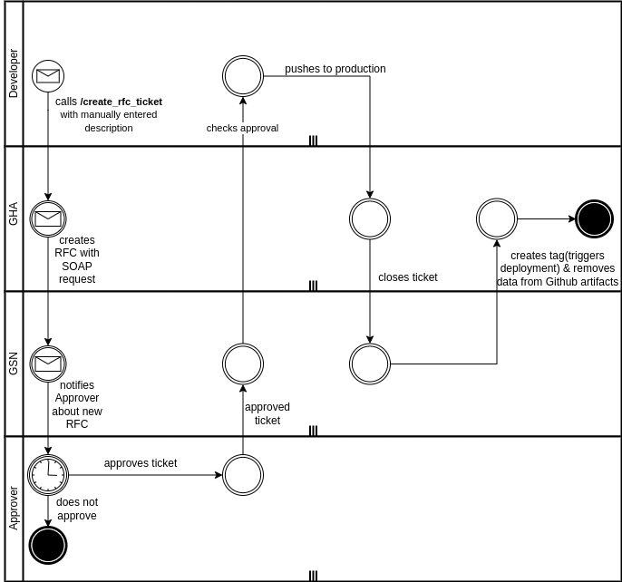
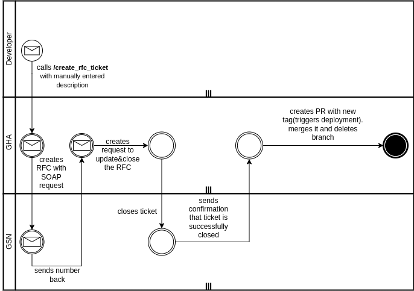
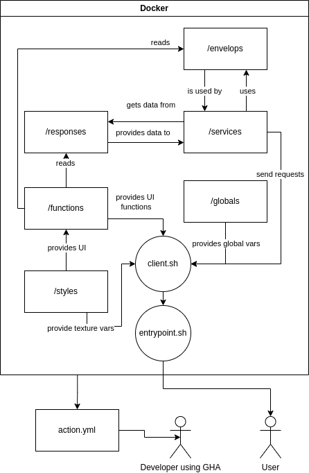

# Hera - GSN Automation

## 1. Intro

[Link to source code](https://git.dhl.com/API-Developer-Portal/rfc_service) - feel free to fork and adjust to your own needs.

GSN Automation provides an efficient solution for managing Requests for changes (RFCs). It enables users to create, update, and close GSN RFCs seamlessly, enhancing the workflow in GitHub Actions. It is quite fast, as it takes around a second for the action to perform, thanks to the Bash scripts and WSDL architecture of requests.

Named after the Greek goddess Hera, this service brings together the API Developer Portal and ServiceNow smoothly and efficiently. It's like a bridge that makes working between these two systems easy and straightforward. Just like Hera united different worlds, this project connects these important tools in a simple, yet powerful way.

## 2. User Guide

### 2.1. GitHub Action

You can integrate GSN Automation into your workflows with the following example:

```yaml
name: Test action

on:
  workflow_call:

jobs:
  test:
    name: Create RFC
    uses: API-Developer-Portal/rfc_service@v4
    with:
      Email: 'name.surname@dhl.com'
      AssignmentGroup: 'GLOBAL-GROUP'
      ApplicationName: 'devportal'
      EscalatedBy: 'name.surname@dhl.com'
      ChangeCoordinator: 'name.surname@dhl.com'
      Title: 'deploy vx.x.x'
      Description: 'test rfc gha'
      Approver: 'gsn_test@dhl.com'
      Template: 'RFCXXXXXXX'
      Username: '${secrets.username}'
      Password: '${secrets.password}'
      Environment: 'uat'

```

### 2.2. Manual usage
 
 For manual operations, use the client.sh script as follows:

```bash
./client.sh create "folder" "number" "description" "username" "password" "env"
./client.sh update "folder" "number"  "username" "password" "env"
./client.sh close "folder" "number"  "username" "password" "env"
```

| Command | Alias | Description | Example                                                     |
|---------|-------|-------------|-------------------------------------------------------------|
| create  | cr    | create RFC  | ```cr "folder" "description" "username" "password" "env"``` |
| update  | u     | update RFC  | ```u "folder"  "number" "username" "password" "env"```      |
| close   | cl    | close  RFC  | ```cl "folder"  "number" "username" "password" "env"```     |
| read    | r     | read   RFC  | ```r  "folder" "number" "username" "password" "env"```      |


It is also important to change the content of the envelops per your choosing. There is a native automated selector which helps you to prefill the envelops through CLI, but if your requests are similar in their content, you can save the data in envelops and deactivate editing fields and add some script to only edit the desired field. Generally this is a handful sandbox with many possibilities and it wants **you** to extend it! Do not hesitate to fork the project and dive in and adjust the service as you wish, since it provides great SOAP CRUD capabilities for other GSN services, and not just GSN. I am planning to add custom environments, origins and endpoints, so you will be free to automate any process which involves SOAP!  


## 3. Developer Guide

### 3.1. Introduction

Developers can handle SOAP requests in services and utilize client.sh for service calls. The GHA client can be injected into the pipeline for streamlined integration. Envelopes for requests and responses are available in the envelops directory.

### 3.2. Process in details

#### Step 1

1. Create new RFC in “Draft” state by calling the change template.

2. Input for below fields must be passed from the interface:
  
    2.a. Requested by – the requestor of this change. It is to refer to the sys_user table for active(true) and existing user + make sure to either refer to the UserID or email ID to ensure that the valid and correct user are entered.
  
    2.b. Planned Start Date and Planned End Date – this contains the date and time. Planned End Date must be after Planned Start Date. Ensure that the time is rounded. The practice is to use full, half or quarter of an hour
  
    2.c. Customer RTP Date – this contains just the date
  
    2.d. Scope of the Change – text field with the length of 4000 character, please set the same in the interface as this is something that need to be send from the interface into RFC.

3. Create the group approval:

    3.a. Assigned Group: CAB-BIMODAL

    3.b. Approval Type: Approval for Implementation

    3.c. SLA Category: 2 days

    3.d. “Wait for” and “Handle a rejection by”, it depends on the number of approver that will be approving this change;

        3.d.i. If only 1 approver then Wait for = Anyone to approve and Handle a rejection by = Rejecting group approval

        3.d.ii. If > then 1 approver then Wait for = Everyone to approve and Handle a rejection by = Waiting for other responses before deciding


4. Create the approver into the group approval which had been created in “Not Yet Requested” state. When the approver is created by referencing to a specific group approval and RFC; number of fields will be inherited from the group approval level.


#### Step 2


1. Update the RFC state from “Draft” to “Registered” and then to “To Be Approved For Implementation”.

2. This will automatically set the UAT CTASK state to “Assigned” AND; this will automatically set the group approval state to “Requested” and the approver within it to “Requested” as well.

3. Then update the UAT CTASK state to “Completed” with the closure code “Implemented” and close note with the text “UAT successfully tested and passed” AND; Then the approvers state in these group approvals are to be set to “Approved” and this will update the group approval state to “Approved” accordingly.

4. Then update the RFC state to “Approved For Implementation”. This will automatically update the implementation CTASK state from “Registered” to “Assigned”.

5. Once the implementation result is obtained from interface; if it;

    5.a. was successful then the implementation CTASK state is to be updated as “Completed” with the closure code “Implemented” and close note with the text “Change successfully implemented”.

    5.b. Failed then the implementation CTASK state is to be updated as “Completed” with the closure code “Failed” and in the close note the reason for the failure is to be passed from interface.

6. Then update the RFC state to “Review”. This will automatically update the “Post Implementation Review” CTASK state from “Registered” to “Assigned”. Next update the Post Implementation Review CTASK:

    6.a. If change was successful then CTASK state is to be updated as “Completed” with the closure code “Implemented” and close note with the text “Change successfully implemented”.

    6.b. If change failed then CTASK state is to be updated as “Completed” with the closure code “Failed”. In the close note the question which is in the instruction field are to be passed together with the response to the question. The input for the “Lesson learned” and “Preventive measures” is to be passed from interface as well.

7. Then update the RFC state to “Closed” and;

    7.a. If change was successful then update the closure code as “Successful” and process policy as “Authorized”.

    7.b. If change failed then update closure code as “Unsuccessful with “Failure Code” and “Failed Change Caused By” passed from interface based on the available choice list of these fields and process policy as “Authorized”.

 
### 3.3. Structure of the project

GHA client can be injected in pipeline or can be started as an independent workflow with inputs triggered by workflow dispatch(user interaction).

Envelops are in ```envelops```.

## BPMN of approach when using the manual client



## BPMN of approach when using the client dedicated for GHA




## Architecture




## Timeline


## Example of flow in GAPI Developer Portal

